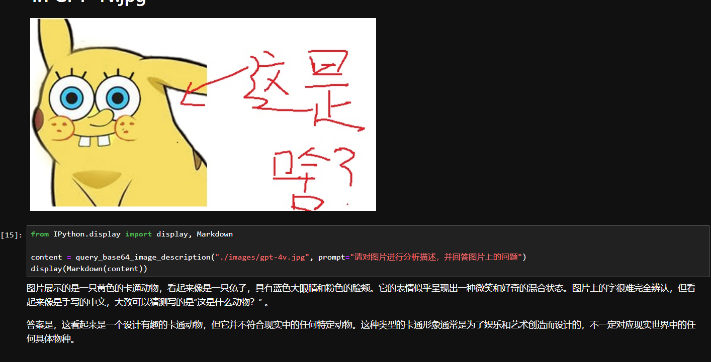
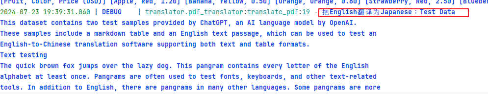
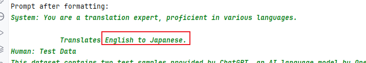
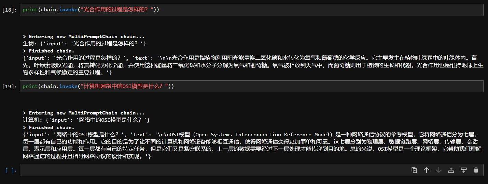

# Day1 Homework

[Chat GPT Share Link](https://chatgpt.com/share/829e35c8-fa40-466f-adb6-9069ead7f69b)

# Day2 Home Work

### 1. GPT-4V的使用

- 1.1 上传自己手写的图片到images文件夹，可命名为gpt-4v.jpg；
- 1.2  修改query_base64_image_description的方法描述，分析gpt-4v.jpg图片；
- 1.3  输出分析结果，并使用函数对输出进行渲染，渲染成Markdown格式使结果更易读；

### 2. ai translator的使用 

- 2.1 ai translator中，添加2种以上的其他语言对翻译

​	1.0 Translater (Open AI API)

​	2.0 Translater (Langchain API)

### 3. 扩展langchain chains

- 3.1 扩展chains，使其支持生物、计算机和汉语文学老师等学科的提示词模板及对应 Chains问答。

